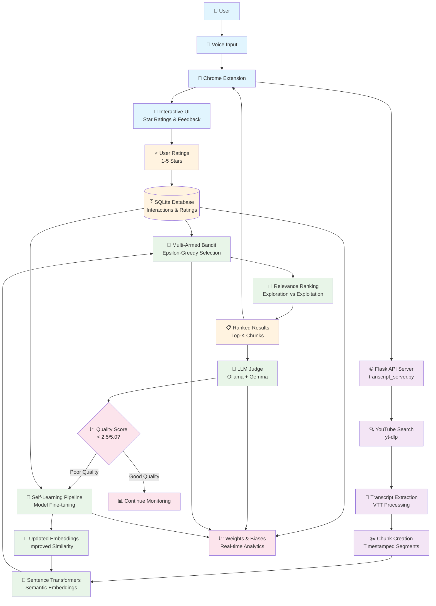

# YouTube Agent - System Architecture

## High-Level Architecture Diagram



## Component Details

### 🎤 **User Interface Layer**
- **Chrome Extension**: Voice-activated search interface
- **Interactive UI**: Star rating system for user feedback
- **Voice Input**: Natural language query processing

### 🌐 **API Layer** 
- **Flask Server**: Main application server (`transcript_server.py`)
- **YouTube Search**: Video discovery using `yt-dlp`
- **Transcript Processing**: VTT extraction and chunking

### 🧠 **AI/ML Layer**
- **Sentence Transformers**: Semantic embedding generation
- **Multi-Armed Bandit**: Epsilon-greedy chunk selection
- **LLM Judge**: Quality assessment using Ollama + Gemma
- **Self-Learning Pipeline**: Automated model fine-tuning

### 🗄️ **Data Layer**
- **SQLite Database**: User interactions and ratings storage
- **Chunk Cache**: Processed transcript segments
- **Model Checkpoints**: Fine-tuned embedding models

### 📊 **Monitoring Layer**
- **Weights & Biases**: Real-time analytics and experiment tracking
- **Performance Metrics**: Response times, user satisfaction
- **Learning Metrics**: Exploration/exploitation ratios, model performance

## Key Data Flows

### 1. **Search Flow**
```
Voice Query → YouTube Search → Transcript Extraction → Chunking → Embedding → Ranking → Results
```

### 2. **Learning Flow**
```
User Ratings → Database → Bandit Update → Improved Selection
```

### 3. **Quality Flow**
```
Search Results → LLM Judge → Quality Assessment → Fine-tuning Trigger
```

### 4. **Monitoring Flow**
```
All Components → Weights & Biases → Real-time Dashboards
```

## Reinforcement Learning Components

### 🎲 **Multi-Armed Bandit**
- **Algorithm**: Epsilon-greedy with decay
- **Arms**: Individual transcript chunks
- **Rewards**: User star ratings (1-5)
- **Exploration**: Tries new chunks to discover relevance
- **Exploitation**: Shows proven relevant chunks

### 🔄 **Self-Learning Pipeline**
- **Trigger**: LLM judge detects quality drop
- **Training Data**: User ratings converted to similarity scores
- **Model**: Fine-tunes Sentence Transformer embeddings
- **Deployment**: A/B tests new vs old model performance

### 🤖 **LLM Judge**
- **Model**: Gemma 2B via Ollama
- **Evaluation**: Scores search result relevance (1-5)
- **Decision**: Triggers fine-tuning when quality < 2.5/5.0
- **Monitoring**: Tracks quality trends over time

## Technical Stack

- **Backend**: Python, Flask, SQLite
- **ML/AI**: Sentence Transformers, scikit-learn, Ollama
- **Frontend**: Chrome Extension (HTML/CSS/JS)
- **Analytics**: Weights & Biases
- **Video Processing**: yt-dlp
- **Deployment**: Local development, cloud-ready

## Innovation Highlights

✅ **Real-time Learning**: System improves with every user interaction  
✅ **Quality Monitoring**: Automated detection of performance degradation  
✅ **Balanced Exploration**: Smart trade-off between trying new vs proven content  
✅ **Semantic Understanding**: Goes beyond keyword matching to understand intent  
✅ **Production Monitoring**: Comprehensive analytics for system health  
